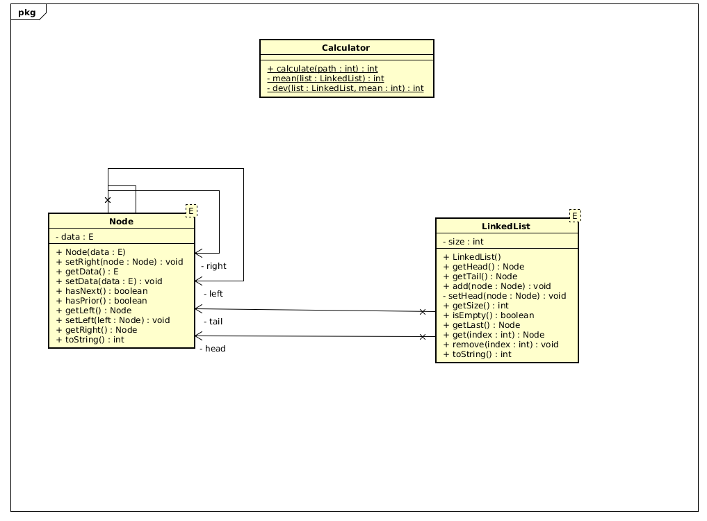

# Project Title

LAB 01 AREP

The project is divided in two packages, model and calculator
The model package contains the LinkedList and the nodes of the same, the LinkedList can store Generic types in it's 
nodes, has a Head and a Tail, which can be both null if it is empty, also Head and Tail can be the same if there is only
one node.

The node has Generic data storaged and two pointers, one for next node and other for prior node.

The calculator Reads From a file each line a Number and calculates the mean and std.dev stored in the Linked List
Returning a map, which makes the calculator extensible if want to introduce more operations

Also the model package should be in a different maven project and be only used as dependency since it's function
has no really relevant importance for the calculator project beyond of being a storeage.

There are too two test with the given values readed from files in the test resources folder.
## Getting Started

- you can run ***mvn Install*** to install it into your maven repo and use it
- Or ***mvn package*** to create the JAR
- ***mvn javadoc:javadoc*** to generate JavaDocs

## Running the tests

-mvn test

## Authors

* **Oscar Pinto** 

## License

This project is licensed under the MIT License - see the [LICENSE.md](LICENSE.md) file for details

